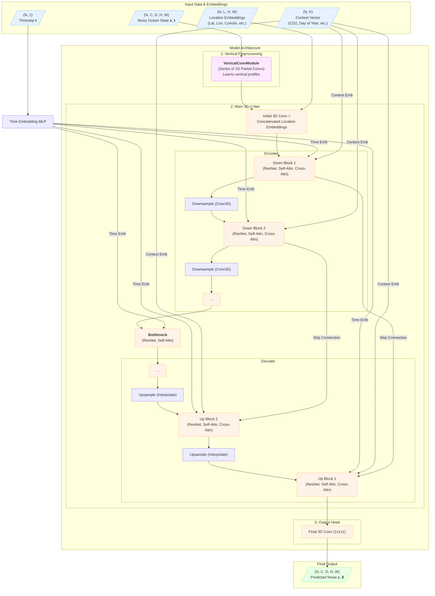

```mermaid
graph TD
    subgraph "Input Data & Embeddings"
        direction LR
        A[/"(N, C, D, H, W)<br>Noisy Ocean State <b>x_t</b>"/]
        B[/"(N, 1)<br>Timestep <b>t</b>"/]
        C[/"(N, K)<br>Context Vector<br>(CO2, Day of Year, etc.)"/]
        D[/"(N, L, H, W)<br>Location Embeddings<br>(Lat, Lon, Coriolis, etc.)"/]
    end

    subgraph "Model Architecture"
        direction TB
        
        subgraph "1. Vertical Preprocessing"
            E["<b>VerticalConvModule</b><br>(Series of 1D Partial Convs)<br><i>Learns vertical profiles</i>"]
        end

        subgraph "2. Main 3D U-Net"
            F["Initial 3D Conv +<br>Concatenated Location Embeddings"]
            
            subgraph "Encoder"
                G["Down Block 1<br>(ResNet, Self-Attn, Cross-Attn)"]
                G_down["Downsample (Conv3D)"]
                H["Down Block 2<br>(ResNet, Self-Attn, Cross-Attn)"]
                H_down["Downsample (Conv3D)"]
                I["..."]
            end

            J["<b>Bottleneck</b><br>(ResNet, Self-Attn)"]

            subgraph "Decoder"
                K["..."]
                L_up["Upsample (Interpolate)"]
                L["Up Block 2<br>(ResNet, Self-Attn, Cross-Attn)"]
                M_up["Upsample (Interpolate)"]
                M["Up Block 1<br>(ResNet, Self-Attn, Cross-Attn)"]
            end
        end

        subgraph "3. Output Head"
            N["Final 3D Conv (1x1x1)"]
        end
    end

    subgraph "Final Output"
        O[/"(N, C, D, H, W)<br>Predicted Noise <b>ε_θ</b>"/]
    end

    %% Data Flow
    A --> E
    E --> F
    D --> F
    F --> G
    G --> G_down
    G_down --> H
    H --> H_down
    H_down --> I
    I --> J
    J --> K
    K --> L_up
    L_up --> L
    L --> M_up
    M_up --> M
    M --> N
    N --> O

    %% Conditioning and Skip Connections
    B_emb["Time Embedding MLP"] -- "Time Emb" --> G
    B_emb -- "Time Emb" --> H
    B_emb -- "Time Emb" --> J
    B_emb -- "Time Emb" --> L
    B_emb -- "Time Emb" --> M
    
    C -- "Context Emb" --> G
    C -- "Context Emb" --> H
    C -- "Context Emb" --> L
    C -- "Context Emb" --> M

    G -- "Skip Connection" --> M
    H -- "Skip Connection" --> L

    B --> B_emb

    %% Styling
    classDef input fill:#e6f2ff,stroke:#b3d9ff,stroke-width:2px;
    classDef output fill:#e6ffe6,stroke:#b3ffb3,stroke-width:2px;
    classDef module fill:#fff2e6,stroke:#ffdab3,stroke-width:2px,rx:5,ry:5;
    classDef specialModule fill:#fde8ff,stroke:#f8c4ff,stroke-width:3px,rx:5,ry:5;
    
    class A,B,C,D input;
    class O output;
    class E,F,G,H,I,J,K,L,M,N module;
    class E specialModule;
```